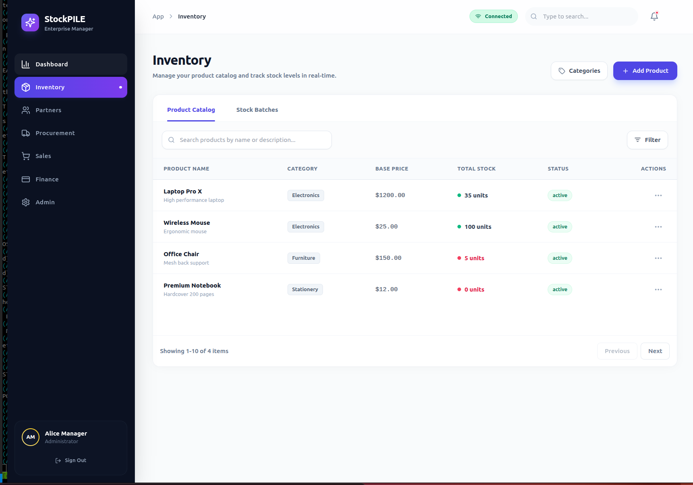

# StockPile

StockPile is a modern, offline-capable Enterprise Resource Planning (ERP) application designed for efficient inventory and business management. Built with a focus on reliability and user experience, it allows businesses to manage their operations seamlessly, whether online or offline.



## 🚀 Features

- **🛡️ Robust Inventory Management**
  - Track products, categories, and real-time stock levels.
  - Manage stock batches and expiration dates.
  - "Add Product" and "Category Management" workflows.

- **fw Offline-First Architecture**
  - **Works everywhere**: Continue working without an internet connection.
  - **Local Database**: Uses robust local persistence (IndexedDB) to save data immediately.
  - **Auto-Sync**: Automatically synchronizes data with the backend when the connection is restored.
  - **Connection Indicator**: Real-time status in the UI (Online/Offline/Syncing).

- **💻 Cross-Platform Support**
  - **Desktop**: Native experience via Electron.
  - **Web**: Responsive web application.

- **🎨 Modern User Interface**
  - Clean, professional design using Tailwind CSS and shadcn/ui.
  - Interactive dashboards and data visualization.

## 🛠️ Tech Stack

- **Core**: [React](https://react.dev/), [TypeScript](https://www.typescriptlang.org/), [Vite](https://vitejs.dev/)
- **Desktop Wrapper**: [Electron](https://www.electronjs.org/)
- **State & Data**: [TanStack Query](https://tanstack.com/query/latest) (React Query)
- **Local Storage**: `idb-keyval` (IndexedDB)
- **UI Framework**: [Tailwind CSS](https://tailwindcss.com/), [shadcn/ui](https://ui.shadcn.com/)
- **Icons**: [Lucide React](https://lucide.dev/)
- **Backend / API**: [Supabase Edge Functions](https://supabase.com/docs/guides/functions) (running [Hono](https://hono.dev/))

## 📸 Views & Screenshots

### Inventory Dashboard
Manage your product catalog with filtering, categorization, and quick actions.
*(Placeholder: Add screenshot to `design/screenshots/inventory.png`)*

### Offline Capability
Visual indicators show the current connection state, ensuring users trust the data integrity.

## 🏁 Getting Started

### Prerequisites
- Node.js (v18 or higher)
- npm

### Installation

1. **Clone the repository**
   ```bash
   git clone <repository-url>
   cd stockpile
   ```

2. **Install Dependencies**
   Navigate to the app directory and install packages:
   ```bash
   cd app
   npm install
   ```

### Running the Application

**🌐 Web Development Mode**
for working on the UI and logic in a browser:
```bash
npm run dev
```

**🖥️ Desktop (Electron) Development Mode**
to test the native desktop experience:
```bash
npm run electron:dev
```

## 📂 Project Structure

```
stockpile/
├── app/                  # Main Application Source
│   ├── src/
│   │   ├── components/   # React Components (Pages, Modals, UI)
│   │   ├── lib/          # API clients, Store Context, Query Client
│   │   │   └── queryClient.ts # Offline persistence configuration
│   │   ├── styles/       # Global styles (Tailwind)
│   ├── electron/         # Electron Main & Preload scripts
│   └── supabase/         # Server-side Edge Functions
├── design/               # Design assets and documentation
└── specs/                # Functional & Technical specifications
```

## 📜 License

Private / Proprietary
